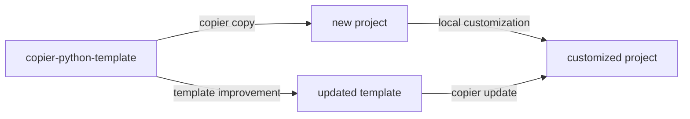

# SS-FHA

Semicontinuous simulation-based flood hazard assessment framework.

- [Installation](installation.md)
- [Usage](usage.md)
- [API Reference](api.md)

## Template update workflow

This project was generated from [copier-python-template](https://github.com/lassiterdc/copier-python-template). Template improvements can be pulled in at any time:

```bash
copier update --skip-tasks
```

The diagram below shows how the template ecosystem works:


